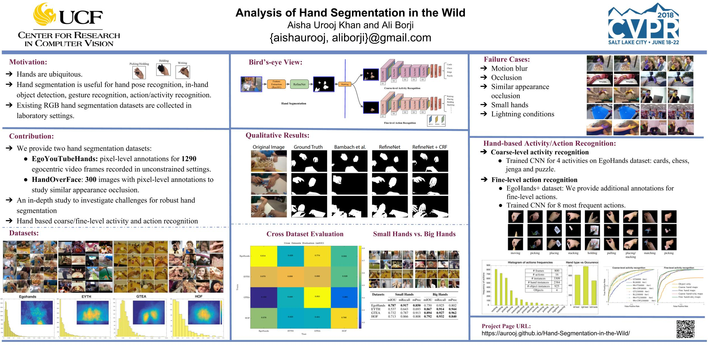

## Analysis of Hand Segmentation in the Wild

### Abstract
A large number of works in egocentric vision have concentrated on action and object recognition. Detection and segmentation of hands in first-person videos, however, has less been explored. For many applications in this domain, it is necessary to accurately segment not only hands of the camera wearer but also the hands of others with whom he is interacting. Here, we take an in-depth look at the hand segmentation problem. In the quest for robust hand segmentation methods, we evaluated the performance of the state of the art semantic segmentation methods, off the shelf and fine-tuned, on existing datasets. We fine-tune RefineNet, a leading semantic segmentation method, for hand segmentation and find that it does much better than the best contenders. Existing hand segmentation datasets are collected in the laboratory settings. To overcome this limitation, we contribute by collecting two new datasets: a) EgoYouTubeHands including egocentric videos containing hands in the wild, and b) HandOverFace to analyze the performance of our models in presence of similar appearance occlusions.
We further explore whether conditional random fields can help refine generated hand segmentations. To demonstrate the benefit of accurate hand maps, we train a CNN for hand-based activity recognition and achieve higher accuracy when a CNN was trained using hand maps produced by the fine-tuned RefineNet. Finally, we annotate a subset of the EgoHands dataset for fine-grained action recognition and show that an accuracy of 58.6% can be achieved by just looking at a single hand pose which is much better than the chance level (12.5%).

* [[Paper]](http://openaccess.thecvf.com/content_cvpr_2018/papers/Urooj_Analysis_of_Hand_CVPR_2018_paper.pdf)
* [[Project]](https://aurooj.github.io/Hand-Segmentation-in-the-Wild/)

### Code
We have uploaded the additional files needed to train, test and evaluate our models' performance. Code for multiscale evaluation is also provided. See the folder ```refinenet_files```.

To test the models:
* you will need to download the refinenet code from their [github repository](https://github.com/guosheng/refinenet). 
* Copy the files provided in ```refinenet_files``` folder to ```refinenet/main``` folder. 
* Place the refinenet-based hand segmentation model (see Models section) in ```refinenet/model_trained``` folder.
* For instance, to test the model trained on EgoHands dataset, copy the ```refinenet_res101_egohands.mat``` file in ```refinenet/model_trained``` folder. Set the path to test images folder in ```demo_refinenet_test_example_egohands.m``` and run the script.
* The demo code is the same from the original refinenet demo files except minor changes. 


### Models
You can download our refinenet-based hand segmentation models using the links given below:

* [refinenet_res101_egohands.mat](https://drive.google.com/file/d/1u7yGIafopsn_w-RHGt1wzO-8XgmL-1zu/view?usp=sharing)
* [refinenet_res101_eyth.mat](https://drive.google.com/file/d/12HRYXdHWOGkl71QqUdlijCq2w2ARa6-M/view?usp=sharing)
* [refinenet_res101_gtea.mat](https://drive.google.com/file/d/1yCnpTpBuBF8wYoM4_E1o8dAWjFS0BkxM/view?usp=sharing)
* [refinenet_res101_hof.mat](https://drive.google.com/file/d/1AOY8EQ9LRNYFusgFxHEhE_fAifNdsayh/view?usp=sharing)

### Datasets
We used 4 hand segmentation datasets in our work, two of them(EgoYouTubeHands and HandOverFace datasets) are collected as part of our contribution:
* [EgoHands dataset](http://vision.soic.indiana.edu/projects/egohands/)
* EgoYouTubeHands(EYTH) dataset [[download]](https://drive.google.com/file/d/1EwjJx-V-Gq7NZtfiT6LZPLGXD2HN--qT/view?usp=sharing)
* [GTEA dataset](http://www.cbi.gatech.edu/fpv/)
* HandOverFace(HOF) dataset [[download]](https://drive.google.com/open?id=1hHUvINGICvOGcaDgA5zMbzAIUv7ewDd3)

#### Warning!
Thanks to [Rafael Redondo Tejedor](https://github.com/valillon) who pointed out some minor mistakes in the dataset:
* For HandOverFace dataset, 216.jpg and 221.jpg images are actually GIFs in the original size folder.
* There were minor annotations errors for the following images in xml files: 10.jpg and 225.jpg which were pointed out and corrected by Rafael Redondo Tejedor.
* Current link to the dataset has updated xml files for the above mentioned annotation errors.

#### NEW!
02/23/2021! Hands masks for GTEA (cropped till wrist) has been uploaded under [ directory. 

Links to the videos used for EYTH dataset are given below. Each video is 3-6 minutes long. We cleaned the dataset before annotation and discarded unnecessary frames (e.g., frames containing text or if hands were out of view for a long time, etc). 

[](https://www.youtube.com/watch?v=dYZm7jB9YA4&feature=youtu.be&hd=1 "vid4")
[](https://www.youtube.com/watch?v=5RTJ4dymKfo&feature=youtu.be&hd=1 "vid6")
[](https://www.youtube.com/watch?v=vG9vfjdcmRw&feature=youtu.be&hd=1 "vid9")


#### NEW!
Test set for HandOverFace dataset is uploaded [here](https://drive.google.com/file/d/1-OmtqYBVmAstCzOKz8xpatw6lk9hUm--/view?usp=sharing).

Example images from EgoYouTubeHands dataset:


Example images from HandOverFace dataset:


* **EgoHands+** dataset:
To study fine-level action recognition, we provide additional annotations for a subset of EgoHands dataset. You can find more details [here](https://github.com/aurooj/Hand-Segmentation-in-the-Wild/blob/master/egohands%2B.md) and download the dataset from this [download](https://drive.google.com/file/d/1WwGNsOhjk3hIKEnDoCKplFvMNroMCxtZ/view?usp=sharing) link.

## Results

### Qualitative Results
Hand segmentation results for all datasets:


### CVPR Poster


### License
We only provide the annotations for the YouTube videos. The copyright to the videos belong to YouTube. The license for our annotations is in the license.txt file. 

### Acknowledgements
We would like to thank undergraduate students Cristopher Matos, and Jose-Valentin Sera-Josef, and MS student Shiven Goyal for helping us in data annotations. 

### Citation
If this work and/or datasets is useful for your research, please cite our paper.

<!---
    @InProceedings{Urooj_2018_CVPR,
    author = {Urooj, Aisha and Borji, Ali},
    title = {Analysis of Hand Segmentation in the Wild},
    booktitle = {The IEEE Conference on Computer Vision and Pattern Recognition (CVPR)},
    month = {June},
    year = {2018}
    }
--->

### Questions?
Please contact 'aishaurooj@gmail.com'


