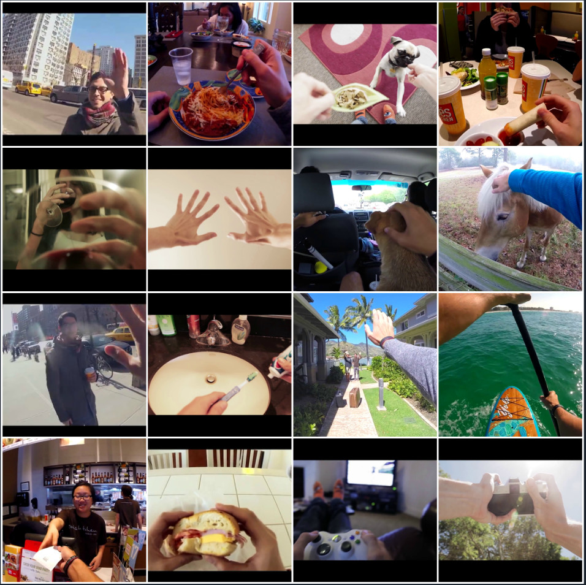
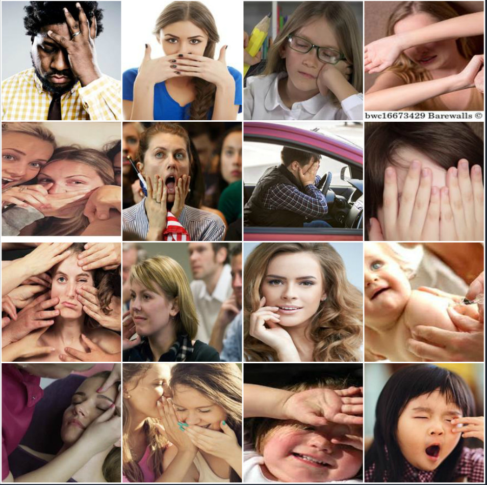
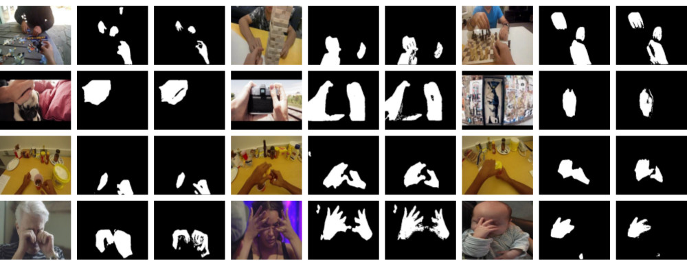

## Analysis of Hand Segmentation in the Wild

### Abstract
A large number of works in egocentric vision have concentrated on action and object recognition. Detection and segmentation of hands in first-person videos, however, has less been explored. For many applications in this domain, it is necessary to accurately segment not only hands of the camera wearer but also the hands of others with whom he is interacting. Here, we take an in-depth look at the hand segmentation problem. In the quest for robust hand segmentation methods, we evaluated the performance of the state of the art semantic segmentation methods, off the shelf and fine-tuned, on existing datasets. We fine-tune RefineNet, a leading semantic segmentation method, for hand segmentation and find that it does much better than the best contenders. Existing hand segmentation datasets are collected in the laboratory settings. To overcome this limitation, we contribute by collecting two new datasets: a) EgoYouTubeHands including egocentric videos containing hands in the wild, and b) HandOverFace to analyze the performance of our models in presence of similar appearance occlusions.
We further explore whether conditional random fields can help refine generated hand segmentations. To demonstrate the benefit of accurate hand maps, we train a CNN for hand-based activity recognition and achieve higher accuracy when a CNN was trained using hand maps produced by the fine-tuned RefineNet. Finally, we annotate a subset of the EgoHands dataset for fine-grained action recognition and show that an accuracy of 58.6% can be achieved by just looking at a single hand pose which is much better than the chance level (12.5%).

* [[Arxiv]](https://arxiv.org/pdf/1803.03317.pdf)
* [[Project]](https://aurooj.github.io/Hand-Segmentation-in-the-Wild/)

### Code
Coming soon..

### Models
You can download our refinenet-based hand segmentation models using the links given below:
* [refinenet_res101_egohands.mat](https://1drv.ms/u/s!AtxSFigVVA5JhNtreE4UkKjC5pmtkg)
* [refinenet_res101_eyth.mat](https://1drv.ms/u/s!AtxSFigVVA5JhNtot-l0EaVnVzDhXw)
* [refinenet_res101_gtea.mat](https://1drv.ms/u/s!AtxSFigVVA5JhNtq9tjNK6KzW4z5kQ)
* [refinenet_res101_hof.mat](https://1drv.ms/u/s!AtxSFigVVA5JhNtpC_uMyBWnP9U4RQ)

### Datasets
We used 4 datasets in our work, two of them(EgoYouTubeHands and HandOverFace datasets) are collected as part of our contribution:
* [EgoHands dataset](http://vision.soic.indiana.edu/projects/egohands/)
* EgoYouTubeHands(EYTH) dataset [[download]](https://1drv.ms/u/s!AtxSFigVVA5JhNtnDn5fyDGWuZXlhg)
* [GTEA dataset](http://www.cbi.gatech.edu/fpv/)
* HandOverFace(HOF) dataset [[download]](https://1drv.ms/u/s!AtxSFigVVA5JhNtm0rxFbLOu-PaAwg)

Example images from EgoYouTubeHands dataset:

Example images from HandOverFace dataset:

## Results

### Qualitative Results
Hand segmentation results for all datasets:

### Citation
If this work and/or datasets is useful for your research, please consider citing:

    @article{khan2018analysis,
      title={Analysis of Hand Segmentation in the Wild},
      author={Khan, Aisha Urooj and Borji, Ali},
      journal={arXiv preprint arXiv:1803.03317},
      year={2018}
    }

### Questions
Please contact 'aishaurooj@gmail.com'

